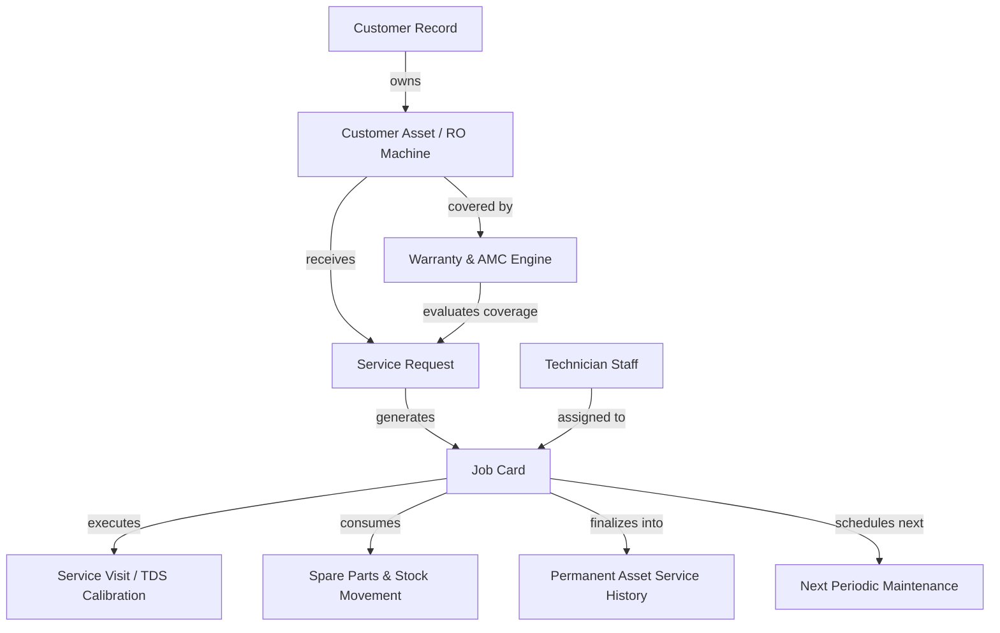

# SR Enterprises CRM — Warranty & Service Management Domain

## 1. Domain Overview & Architecture

The **Service Management Domain** is the core post-sale lifecycle engine of the SR Enterprises CRM/SRM. It establishes a resilient, authoritative, and auditable chain connecting the customer, physical installed RO machine, warranty coverage, service scheduling, field job execution, technician dispatch, spare parts usage, and continuous service history.

---

## 2. Core Entities & Lifecycle States

### A. Customer Asset (`customer_assets`)
- The physical RO water purifier machine installed at a customer's site.
- Identified by unique **Asset Number** (`ASSET-YYYY-XXXX`) and **Serial Number** (e.g. `SN-COPPER-89021`).
- Holds physical location address ID, purchase date, default warranty duration, and periodic service interval.

### B. Warranty Engine (`warranties` & `warranty_events`)
- **Warranty Numbers**: Format `WAR-YYYY-XXXX`.
- **Types**: `STANDARD_MACHINE` (1 year unit warranty), `EXTENDED_MACHINE` (Extended coverage), `SPARE_PART` (Component warranty).
- **Statuses**: `ACTIVE`, `EXPIRING_SOON` ($\le 30\text{ days}$), `EXPIRED`, `VOID`.
- **Lifecycle Events**:
  - `ACTIVATED`: Initial activation upon machine sale/installation.
  - `EXTENDED`: Warranty duration lengthened.
  - `CLAIM_FILED`: Customer submitted warranty claim.
  - `VOIDED`: Voided due to unauthorized tampering or manual cancellation.
  - `EXPIRED`: System or scheduled date passed end date.

### C. Service Requests (`services`)
- **Service Numbers**: Format `SRV-YYYY-XXXX`.
- **Types**: `INSTALLATION`, `REPAIR`, `PERIODIC_MAINTENANCE`, `EMERGENCY`, `SPARE_REPLACEMENT`.
- **Locations**: `DOORSTEP`, `IN_SHOP`.
- **Classifications**: `WARRANTY` (Free under coverage), `GENERAL` (Billable post-warranty or out-of-scope).
- **Statuses**: `SCHEDULED` $\rightarrow$ `ASSIGNED` $\rightarrow$ `IN_PROGRESS` $\rightarrow$ `COMPLETED` / `CANCELLED`.
- **Priorities**: `LOW`, `NORMAL`, `HIGH`, `URGENT`.

### D. Job Cards & Field Operations (`job_cards`)
- **Job Card Numbers**: Format `JC-YYYY-XXXX`.
- **Statuses**: `SCHEDULED` $\rightarrow$ `ASSIGNED` $\rightarrow$ `IN_PROGRESS` $\rightarrow$ `ON_HOLD` $\rightarrow$ `COMPLETED` / `CANCELLED`.
- **Fields Recorded on Completion**:
  - `diagnosis`: Root cause of issue / membrane condition.
  - `workPerformed`: Itemized summary of labor and maintenance steps.
  - `partsReplaced`: Array of replaced spares with quantity, warranty coverage status, and pricing.
  - `inputTds` & `outputTds`: Water purification quality readings before and after service.
  - `customerRating` (1 to 5 stars) and `customerFeedback`.
  - `laborCharges`, `partsCharges`, `totalCharges`.
  - `nextServiceRecommendationMonths`: Recommended next visit cadence (defaults to 3-6 months).

---

## 3. Strict Business Rules & Security

1. **Strict Asset Ownership Validation**:
   - Every service request and warranty registration validates that $\text{asset.customerId} == \text{input.customerId}$.
   - Cross-customer service scheduling attempts are blocked with `400 INVALID_ASSET_OWNERSHIP`.

2. **Authoritative Warranty Eligibility Engine**:
   - Warranty eligibility is calculated server-side based on the asset's active warranty record and current date.
   - Frontend cannot override warranty coverage flags.

3. **Field Technician IDOR Security**:
   - Super Admins, Admins, and Staff have global operational access.
   - Field Technicians can only view, accept, start, and complete job cards explicitly assigned to their technician ID.

4. **Sequential Business Identifiers**:
   - Concurrency-safe, sequential business numbers via PostgreSQL sequences (`generateBusinessNumber`):
     - Warranties: `WAR-2026-XXXX`
     - Services: `SRV-2026-XXXX`
     - Job Cards: `JC-2026-XXXX`

5. **Historical Service Preservation**:
   - Completed service records and job cards are permanent and immutable.
   - Deletion of completed records is prohibited; audit logs and timeline events record all status changes.

---

## 4. API Endpoints Reference

| Endpoint | Method | RBAC Permission | Description |
| :--- | :---: | :---: | :--- |
| `/api/v1/warranties` | `GET` | `assets.view` | Paginated list of warranties with multi-criteria filters |
| `/api/v1/warranties/kpis` | `GET` | `assets.view` | Operational warranty KPIs (Active, Expiring Soon, Expired, Void) |
| `/api/v1/warranties/expiring` | `GET` | `assets.view` | Warranties expiring within $N$ days |
| `/api/v1/warranties/:id` | `GET` | `assets.view` | Single warranty detail with full lifecycle audit events |
| `/api/v1/warranties` | `POST` | `assets.update` | Register new warranty with asset ownership check |
| `/api/v1/warranties/:id` | `PATCH` | `assets.update` | Update warranty status, extension, or terms |
| `/api/v1/warranties/:id/cancel` | `POST` | `assets.update` | Void/Cancel warranty with required audit reason |
| `/api/v1/services` | `GET` | `services.view` | Paginated service requests |
| `/api/v1/services/kpis` | `GET` | `services.view` | Service operational metrics and completion counts |
| `/api/v1/services/heatmap` | `GET` | `services.view` | GitHub-style activity grid aggregation by date |
| `/api/v1/services/upcoming` | `GET` | `services.view` | Upcoming service visits |
| `/api/v1/services/overdue` | `GET` | `services.view` | Overdue incomplete service requests |
| `/api/v1/services/technicians` | `GET` | `services.view` | Active technicians dropdown list |
| `/api/v1/services/:id` | `GET` | `services.view` | Single service request with joined job card |
| `/api/v1/services` | `POST` | `services.create` | Schedule service & auto-generate linked Job Card |
| `/api/v1/services/:id` | `PATCH` | `services.update` | Update service schedule or assign technician |
| `/api/v1/services/:id/cancel` | `POST` | `services.update` | Cancel service request with reason |
| `/api/v1/services/:id/complete` | `POST` | `services.complete` | Complete service & finalize job card |
| `/api/v1/job-cards` | `GET` | `services.view` | Paginated job cards |
| `/api/v1/job-cards/kpis` | `GET` | `services.view` | Job card workflow status counts |
| `/api/v1/job-cards/:id` | `GET` | `services.view` | Single job card detail |
| `/api/v1/job-cards/:id/assign` | `POST` | `services.update` | Assign technician to job card |
| `/api/v1/job-cards/:id/start` | `POST` | `services.update` | Mark job started (`IN_PROGRESS`, set `startedAt`) |
| `/api/v1/job-cards/:id/complete` | `POST` | `services.complete` | Finalize job card with TDS, parts, and charges |
| `/api/v1/assets/:id/warranty` | `GET` | `assets.view` | Get active warranty for an asset |
| `/api/v1/assets/:id/service-history`| `GET` | `assets.view` | Get all past services & job cards on an asset |
| `/api/v1/customers/:id/services` | `GET` | `customers.view` | Get all services for a customer |
| `/api/v1/customers/:id/warranties`| `GET` | `customers.view` | Get all warranties for a customer |
| `/api/v1/customers/:id/job-cards` | `GET` | `customers.view` | Get all job cards for a customer |
